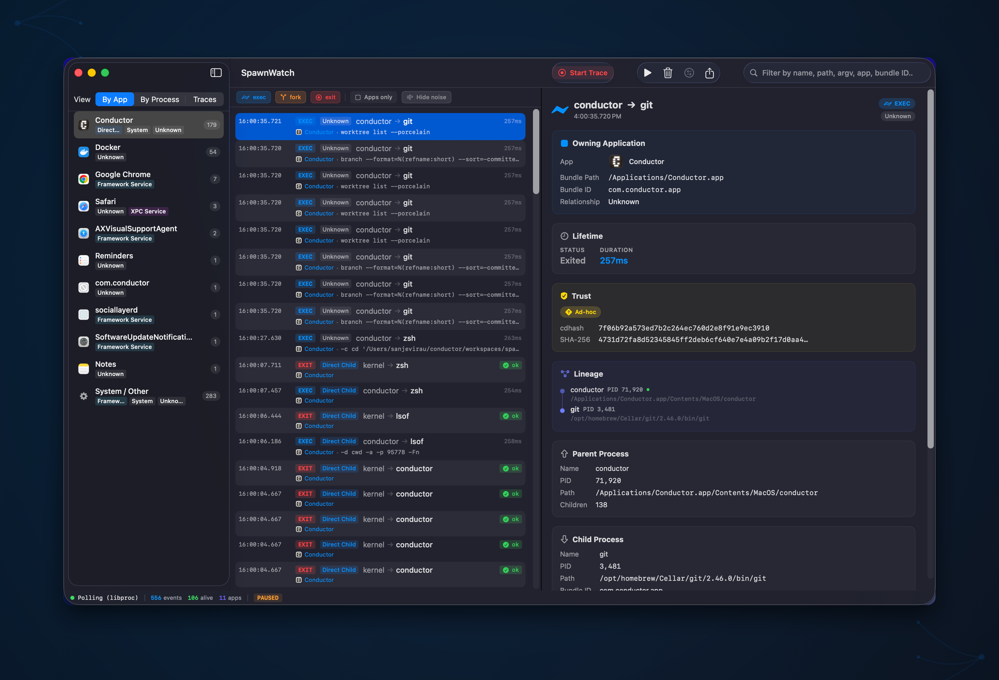

<p align="center">
  
</p>

<p align="center">
  <a href="https://github.com/sanjevirau/spawn-app/actions/workflows/ci.yml"></a>
  <a href="https://github.com/sanjevirau/spawn-app/releases"></a>
  
  
  <a href="LICENSE"></a>
</p>

SpawnWatch shows every process your Mac launches in real time, attributed back to the macOS app that caused it, with full command lines, parent/child trees, code-signing trust, and trace mode for bracketed workflow capture.

> **Status:** early preview (`v0.1.0`). All four headline features are functionally complete and the test suite is green, but the app hasn't yet been battle-tested across many macOS versions and third-party apps. Bug reports and PRs especially welcome at this stage.

<p align="center">
  
</p>

## Why this exists

`ps` is a snapshot. Activity Monitor doesn't show launches. `dtrace` is restricted on modern macOS and unfriendly even when it works. Objective-See's ProcessMonitor is great but is CLI-only with no app attribution.

SpawnWatch fills that gap with a SwiftUI app that:

- Streams every `exec` / `fork` / `exit` event the moment it happens
- Walks the executable path back to the owning `.app` bundle and classifies the relationship (`XPC Service`, `App Extension`, `Helper`, `Framework Service`, `Direct Child`, `System`)
- Inspects code signing for every spawned binary — team ID, notarization, hardened runtime, library validation, sandbox status, SHA-256
- Maintains a live process tree resilient to PID reuse (composite `(pid, spawnTime)` keys)
- Persists "trace sessions" (start → run-your-command → stop) and lets you diff two runs side-by-side

## Features

| | |
|--|--|
| **Real-time stream** | `exec` / `fork` / `exit` events with full argv, cwd, and timestamps. Falls back to `libproc` polling if the user denies admin auth. |
| **App attribution** | Every spawn is mapped back to its owning macOS app and classified by relationship. |
| **Code-signing trust** | `SecStaticCode` inspection on every binary, async + cached. Color-coded badges for Apple / Developer ID / ad-hoc / unsigned. |
| **Lineage** | Click any process, see its full ancestor chain back to launchd. |
| **Process lifecycle** | Live "alive 2.4s" vs "exited (code 0) after 1.2s" status. Killed-by-signal and non-zero exits highlighted. |
| **Trace mode** | Click "Start Trace", run your command, click "Stop". Get a bracketed tree with durations, exit codes, and signing badges. Saved to `~/Library/Application Support/SpawnWatch/Traces/`. |
| **Trace diff** | Compare two saved traces. Multiset diff over `(parent, child, normalized argv)` with PID/tmp/timestamp/hash normalization. |
| **Filters** | Toggle event types, hide system noise, search by name / argv / app / bundle ID. |
| **Pause / resume** | Buffers events while paused, flushes on resume — no events lost. |

## Install

### Pre-built (recommended)

1. Grab `SpawnWatch.zip` from the [Releases](https://github.com/sanjevirau/spawn-app/releases) page — **universal binary**, runs natively on Apple Silicon (M-series) and Intel.
2. Unzip and drag `SpawnWatch.app` to `/Applications`
3. **First launch:** see [Gatekeeper](#gatekeeper-it-cant-be-checked-for-malicious-software) below — the app is unsigned, so you'll need to bypass once

### From source

```sh
git clone https://github.com/sanjevirau/spawn-app.git
cd spawn-app
swift run                                 # runs as a SwiftPM executable (host arch)
./Scripts/build-app.sh release            # produces build/SpawnWatch.app (host arch — fast)
./Scripts/build-app.sh release --universal  # universal arm64 + x86_64 (matches Releases)
open build/SpawnWatch.app
```

Requires macOS 14 (Sonoma) or later and Swift 6.0 (Xcode 16).

## Gatekeeper: "it can't be checked for malicious software"

SpawnWatch is **unsigned and unnotarized**. Apple charges $99/year for a Developer ID, which makes no sense for a free dev tool. macOS will block the first launch. Two ways past it:

**Right-click → Open** (one-time):
1. In Finder, right-click `SpawnWatch.app` → choose `Open`
2. Click `Open` in the warning dialog
3. (On Sonoma+) you may need: System Settings → Privacy & Security → "Open Anyway"

**Or via Terminal** (one command):

```sh
xattr -dr com.apple.quarantine /Applications/SpawnWatch.app
```

After this, double-clicking works normally.

## Why does it ask for my admin password?

To get **real-time** events, SpawnWatch runs `eslogger exec fork exit` — Apple's Endpoint Security CLI — which requires root. We launch it via `osascript … with administrator privileges`, which triggers the standard macOS auth dialog. SpawnWatch never stores your password and only uses it to spawn one privileged child process per launch.

If you decline, SpawnWatch falls back to `libproc` polling at 250 ms intervals. You'll still get spawn and exit events (the latter via PID-disappearance detection), but you'll miss short-lived processes and you won't have exit codes.

## Architecture

```
SpawnWatchCore/         # Library (no UI deps)
  Models/               # SpawnEvent, ProcessKey, ProcessRecord, ProcessSnapshot
  Monitors/             # ESLoggerMonitor (real-time), PollingMonitor (fallback), CompositeMonitor (dedup)
  Parsers/              # ESLoggerParser (handles exec/fork/exit JSON), BundleResolver (app attribution)
  Trust/                # SigningInspector actor, TrustInfo, AsyncSemaphore
  Trace/                # TraceSession, TraceStore (persisted JSON), TraceDiffer (multiset diff)
  Utilities/            # PrivilegeHelper (osascript wrapper)

SpawnWatch/             # App target
  ViewModels/           # SpawnEventStore, TraceController
  Views/                # SwiftUI views

Tests/SpawnWatchCoreTests/  # 21 tests across parsers, tree, differ
```

The store is `@MainActor @Observable`. Process records are `@Observable` classes so SwiftUI re-renders when individual fields (trust, exitCode) change without invalidating the whole record map.

## Roadmap

| Version | Focus |
|---------|-------|
| **v0.1** *(current)* | Live monitor, trust info, lineage, trace mode + diff |
| v0.2 | Menu-bar mode (background run), always-on JSONL log to disk |
| v0.3 | Rules + macOS notifications ("alert when unsigned binary execs from /tmp") |
| v0.4 | CLI companion (`spawnwatch tail`, `spawnwatch trace -- npm install`) |
| later | Cross-app spawn diff history, performance overlays, env-var inspection |

## Contributing

PRs welcome. Areas where help is especially appreciated:

- **More test coverage** — `SigningInspector`, `SpawnEventStore`, `TraceStore` round-trips
- **Argv normalization patterns** — the multiset diff is only as good as `TraceDiffer.normalize`. New patterns for common tooling (Xcode, npm, cargo) would help.
- **Bundle resolver corner cases** — apps inside other apps, framework-bundled CLI tools, weird notarization chains
- **Polish** — better empty states, animation tuning, dark-mode review

See [CONTRIBUTING.md](CONTRIBUTING.md) for build/test commands and conventions.

## Brand assets

Logo, wordmark, and social card SVG sources live in [`Brand/`](Brand/). The build pipeline mirrors the icon design in `Scripts/generate-icon.swift` using CoreGraphics, so `AppIcon.icns` is reproducible from source — no SVG-to-PNG tool required.

- [`Brand/AppIcon.svg`](Brand/AppIcon.svg) — 1024×1024 app icon source
- [`Brand/header.svg`](Brand/header.svg) — self-contained hero banner used above (looks correct on both light & dark themes)
- [`Brand/logo-wordmark.svg`](Brand/logo-wordmark.svg) — transparent-bg wordmark for light-only contexts
- [`Brand/social-card.svg`](Brand/social-card.svg) — 1280×640 GitHub repo social preview. Convert to PNG (`rsvg-convert -w 1280 Brand/social-card.svg -o social.png`) and upload via repo Settings → Social preview.

The same brand mark also appears inside the app on every empty state so the visual identity stays consistent from the README to the running window.

## License

[MIT](LICENSE)
